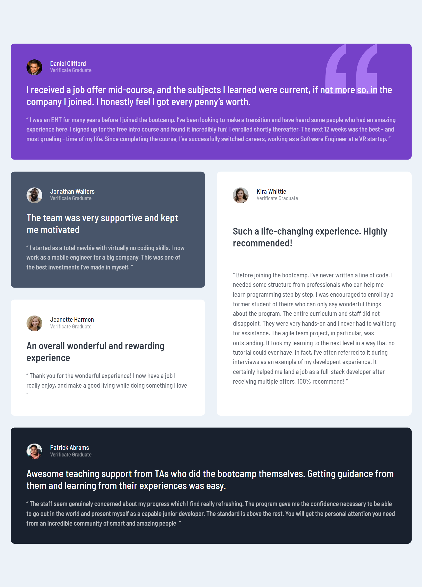
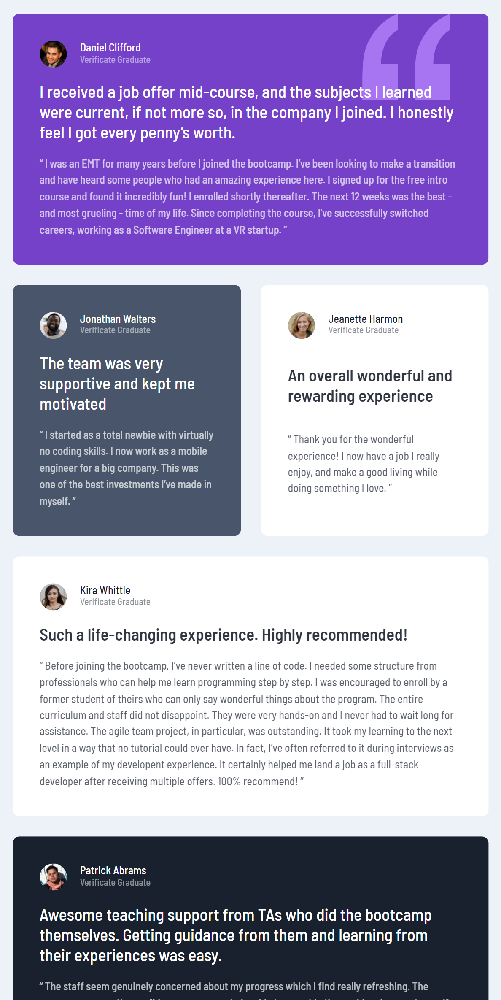
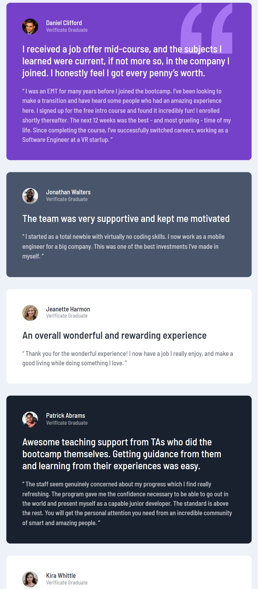

# Frontend Mentor - Testimonials grid section solution

This is a solution to the [Testimonials grid section challenge on Frontend Mentor](https://www.frontendmentor.io/challenges/testimonials-grid-section-Nnw6J7Un7). Frontend Mentor challenges help you improve your coding skills by building realistic projects. 

## Table of contents

- [Overview](#overview)
  - [The challenge](#the-challenge)
  - [Screenshot](#screenshot)
  - [Links](#links)
- [My process](#my-process)
  - [Built with](#built-with)
  - [What I learned](#what-i-learned)
  - [Continued development](#continued-development)
  - [Useful resources](#useful-resources)
- [Author](#author)
- [Acknowledgments](#acknowledgments)

**Note: Delete this note and update the table of contents based on what sections you keep.**

## Overview

### The challenge

Users should be able to:

- View the optimal layout for the site depending on their device's screen size

### Screenshot







### Links

- Solution URL: [Add solution URL here](https://github.com/iisraa11/FEM-Grid-Layout)
- Live Site URL: [Add live site URL here](https://iisraa11.github.io/FEM-Grid-Layout/)

## My process

### Built with

- Semantic HTML5 markup
- CSS custom properties
- Flexbox
- CSS Grid

### What I learned

Use this section to recap over some of your major learnings while working through this project. Writing these out and providing code samples of areas you want to highlight is a great way to reinforce your own knowledge.

To see how you can add code snippets, see below:

```html
<h1>Some HTML code I'm proud of</h1>
```
```css
.testimonials-grid {
  grid-template-areas: 
  'one one two five'
  'three four four five';
}

@media screen and (max-width:75rem) {
  .testimonials-grid {
    grid-template-areas: 
    'one one two'
    'five five five '
    'three four four';
  }
}

@media screen and (max-width:54rem) {
  .testimonials-grid {
    grid-template-areas: 
    'one one'
    'two five'
    'three five'
    'four four';
  }
}

@media screen and (max-width:38rem) {
  .testimonials-grid {
    grid-template-areas: 
    'one one'
    'two three'
    'five five'
    'four four';
  }
}

@media screen and (max-width:33rem) {
  .testimonials-grid {
    grid-template-areas: 
    'one'
    'two'
    'three'
    'four'
    'five';
  }
}
```
## Author

- Github - [@yourusername](https://github.com/iisraa11)
- Frontend Mentor - [@yourusername](https://www.frontendmentor.io/profile/iisraa11)
- LinkedIn - [@yourusername](https://www.linkedin.com/in/israel-guerrero-ortiz-6201a0168)

## Acknowledgments

Thank you to Kevin Powell for the great teachings and tricks. https://www.youtube.com/watch?v=rg7Fvvl3taU&t=1693s&pp=ugMICgJlcxABGAHKBRFrZXZpbiBwb3dlbGwgZ3JpZA%3D%3D
